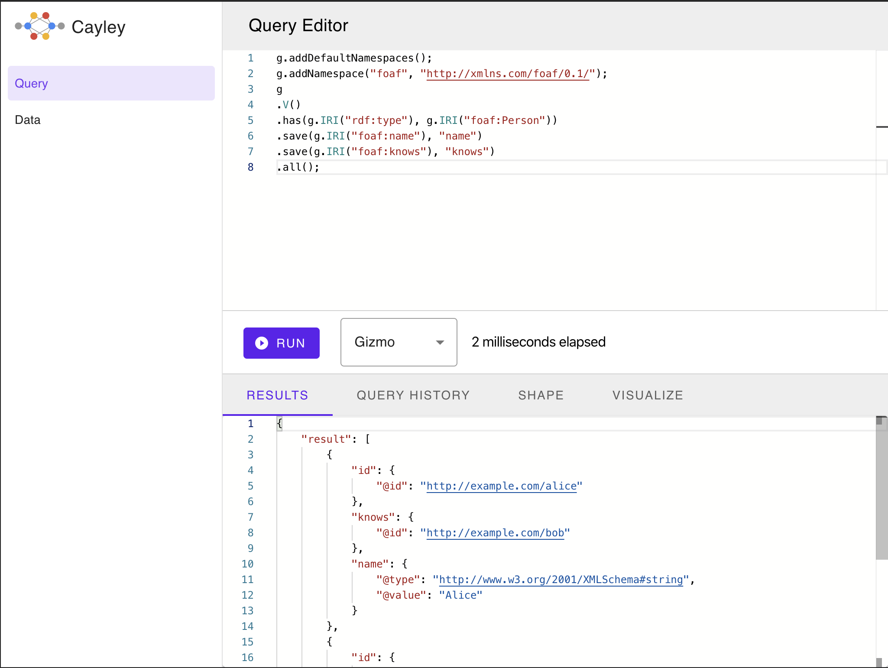

# Cayley Web

[](https://hub.docker.com/repository/docker/cayleygraph/web/)
[](https://travis-ci.com/cayleygraph/web)

Web interface for [Cayley](https://cayley.io)



## Table of Contents

- [Run](#Run)
- [Features](#Run)
- [Technologies Used](#technologies-used)
- [Develop](#Develop)

## Run

### Run with Docker

```bash
docker run -p 3000:80 cayleygraph/web
```

#### Modify Server URL

By default, the server URL is set to http://localhost:64210 (the default Cayley server URL). To change it pass `SERVER_URL` environment variable.
For example:

```
docker run -p 3000:80 --env SERVER_URL="http://example.org:64210" cayleygraph/web
```

## Features

- Query Editor
- Data Editor
- Data Browser

### Technologies Used

- [React](https://reactjs.org) ([CRA](https://create-react-app.dev/))
- [TypeScript](https://www.typescriptlang.org/)
- [Monaco Editor](https://microsoft.github.io/monaco-editor/)
- [RMWC](https://rmwc.io/)
- [React Select](https://react-select.com/)
- [Yarn](https://yarnpkg.com/)

## Develop

1. Make sure to have [Node.js](https://nodejs.org/en/download/), [Yarn](https://classic.yarnpkg.com/en/docs/install) and a modern web browser
2. Clone the repository
3. Get into the cloned directory
4. Install dependencies
   ```bash
   yarn
   ```
5. Run Cayley HTTP Server
   ```bash
   cayley http
   ```
6. Start the development server
   ```
   yarn start
   ```
7. Run tests
   ```
   yarn test
   ```
